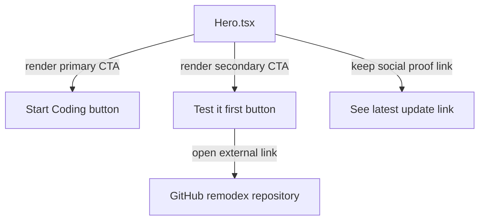

# Recap: Open Source CTA
> Generated: 2026-03-09  |  Scope: 1 file

---

## Summary

The goal of this task was to surface the new open source remote-control version of the product on the landing page without disrupting the main conversion flow. The hero CTA area was updated to keep the primary "Start Coding" action while adding a secondary outlined button that links to the `remodex` GitHub repository so visitors can try remote control too. The website now presents both paths clearly in the first screen.

---

## Files Affected

| File | Status | Role |
|---|---|---|
| `src/components/Hero.tsx` | ✏️ Modified | Added the secondary outlined GitHub CTA and clarified CTA section comments |

---

## Logic Explanation

### Problem
The landing page only offered a single primary CTA for starting with the main product flow. After shipping an open source remote-control version, there was no visible way for curious visitors to try that lighter-weight path directly from the hero section.

### Approach
The change was made inside the hero because that is the first and highest-intent area on the page. The solution keeps the existing primary CTA first for conversion, then adds a visually lighter outlined button beside it so the new option is discoverable without stealing focus.

### Step-by-step
1. The existing hero CTA block was changed from a single anchor into a small responsive action group. This lets both actions sit side by side on larger screens and stack cleanly on mobile.
2. A new GitHub icon import was added so the secondary action immediately reads as an open source path. That reinforces the meaning of the button before the user even reads the label fully.
3. The new secondary button was linked to `https://github.com/Emanuele-web04/remodex` and styled with a subtle border and hover state. This gives it the "outlined" treatment the request called for while matching the rest of the hero.
4. The existing "See latest update" link stayed in place below the CTA group so public progress context remains available. That preserves the current information hierarchy instead of reshuffling unrelated hero elements.

### Tradeoffs & Edge Cases
The secondary CTA intentionally uses lighter styling so it does not compete too aggressively with the main signup action. The label "Test it first" is short and flexible, but it assumes visitors understand the GitHub icon and are comfortable trying an open source repo as a first step.

---

## Flow Diagram

### Happy Path

---

## High School Explanation

Imagine the homepage is like the front desk of a club. Before, there was only one big button that basically said "come inside." Now there is still that main button, but next to it there is a second smaller one that says, in practice, "want to peek at the free demo version first?"

That second button points straight to the GitHub repo for the open source version. It looks lighter, like an outline, so people still notice the main path first. On a big screen the two buttons sit next to each other, and on a phone they stack nicely so nothing gets cramped.
